# STUDENT ESSENTIAL STORE
## SCHOLAR MART
## Theme
This project is a e-commerce website ("Scholar Mart") built as a modern UI dashboard and shopping experience. It is a student centric website where students are buyers and can directly purchase items like stationary, gadgets and equipments required from seller.

It includes pages for login, registration, shopping cart, billing, profile management, seller tools, and customer support. The design focuses on a clean, modern layout with responsive navigation, polished visual styling, and intuitive user workflows.

## Team Members and Contributions
| Roll No          | Student Name      | Role        |
| ---------------- | ----------------- |--------------
| AM.SC.U4CSE25218 | Tulasi Lasya      | React and Frontend developer |
| AM.SC.U4CSE25220 | Hansika L Chawla    | HTML and Accessibilty Lead |
| AM.SC.U4CSE25236 | Nandana Jayakumar |  Styling Lead and Documentation|
| AM.SC.U4CSE25230 | Lekshmi Nandana   |  Observer and testing |

## Project Structure (repository root)
- `index.html` — main landing page
- `css/` — stylesheet files for each page and common layout
- `js/` — JavaScript files for dynamic page interactions
- `pages/` — HTML pages for different sections of the app
- `assets/` — images and icons used in the website design
- `Output/` — screenshots of the website

# Technologies
- HTML5 for page structure
- CSS3 (responsive design, layout and components)
- JavaScript (vanilla) for client-side interactions
- React (used for interactive components)
  
## Features Implemented
- Multi-page site: Homepage, About, Shop/Dashboard, Cart, Billing, Profile, Seller pages, Feedback, Query, Reset-password, Register, Login.
- Responsive layouts and reusable card components for products.
- Cart add/remove, stock indicators, visual product cards, and simple filtering UI.
- Form templates for login, register, feedback, and queries.
## WEBSITE LINK
[Website Link](https://tulasilasya.github.io/UID_Project/)
## OUTPUT
### Default Page
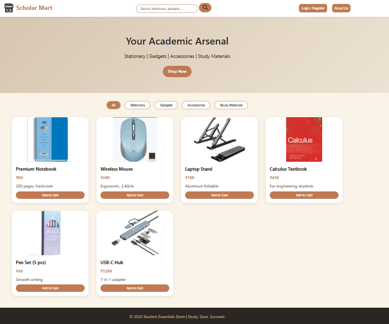
### Login Page
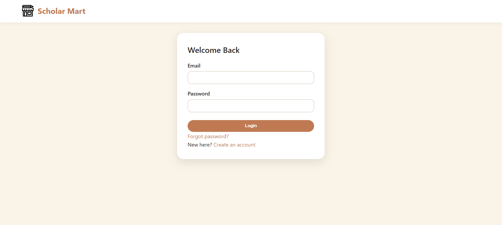
### Register Page
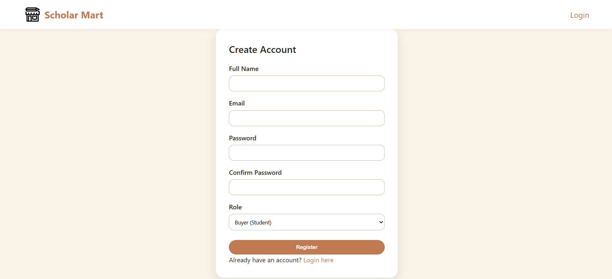
### Reset Password Page
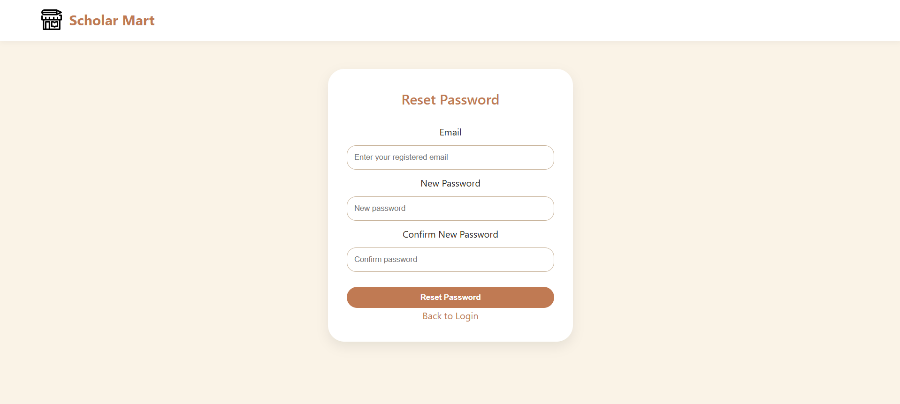
### About Us Page

### Buyer Dashboard Page
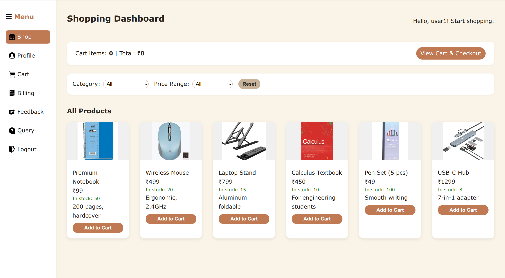
### Buyer Cart Page
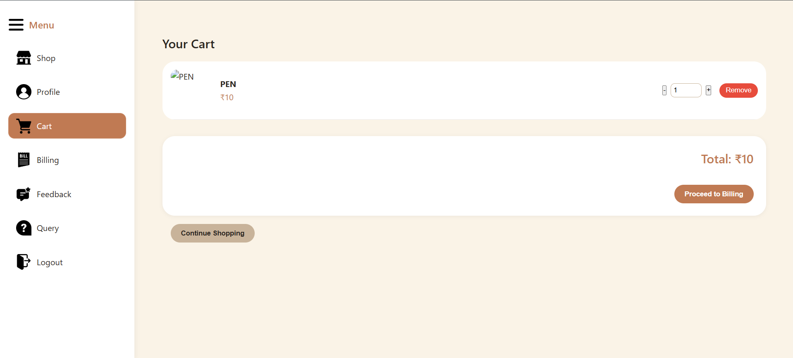
### Buyer Billing Page
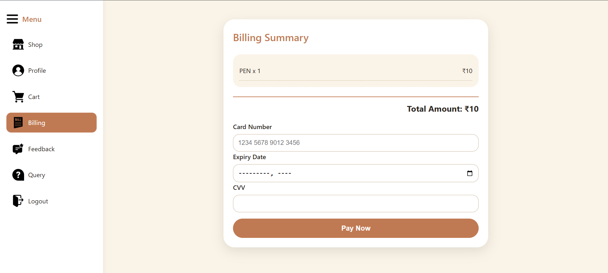
### Buyer Profile Page 
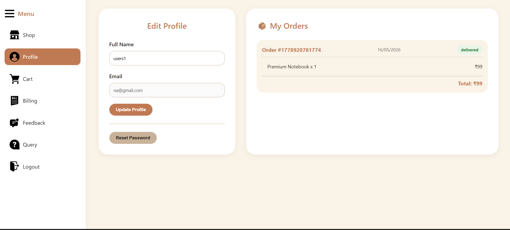
### Buyer feedback Page 
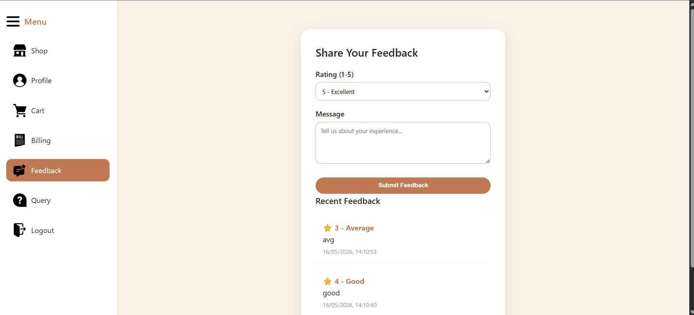
### Buyer query Page
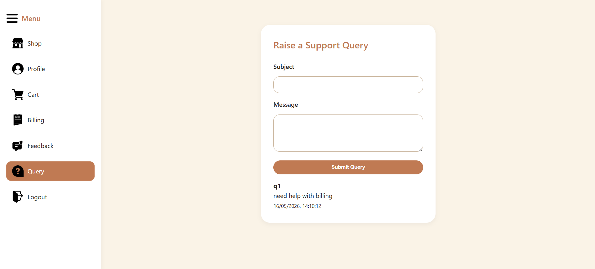
### Seller Profile Page 
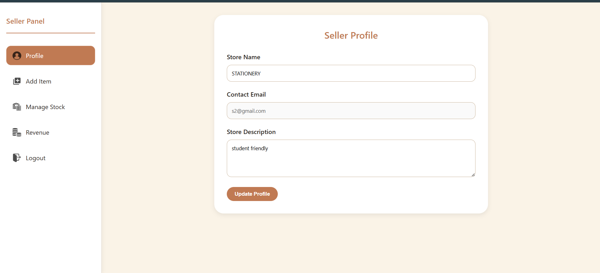
### Seller Add Item Page
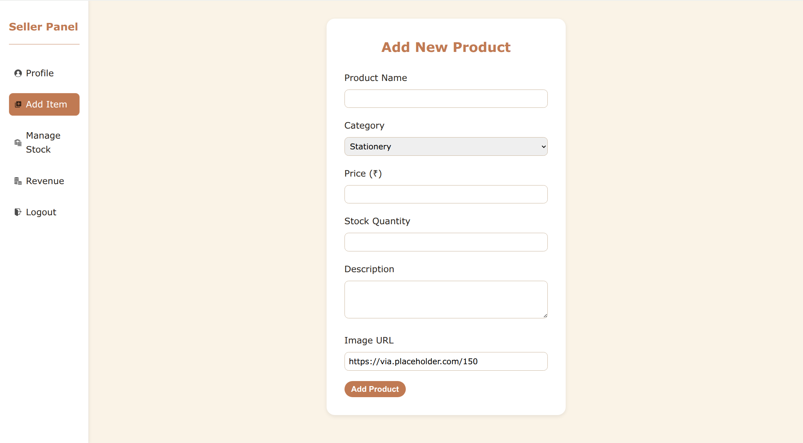
### Seller Manage Stocks Page
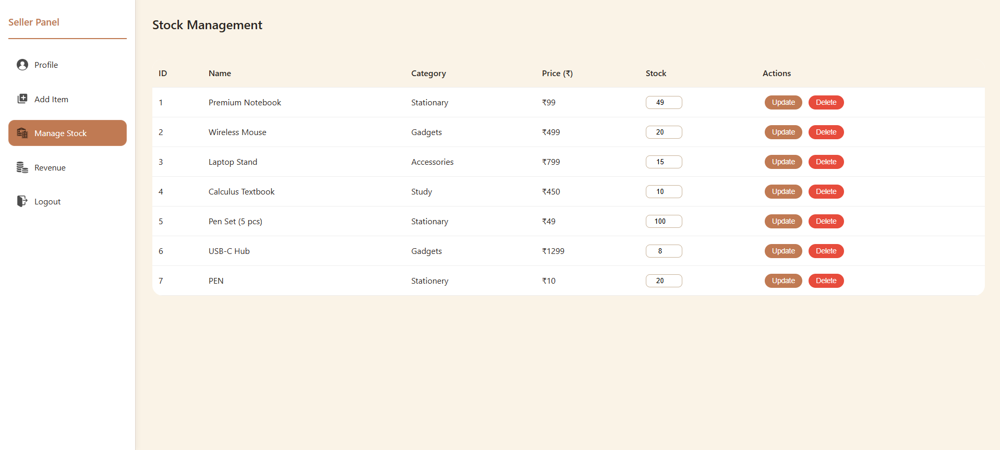
### seller Revenue Page
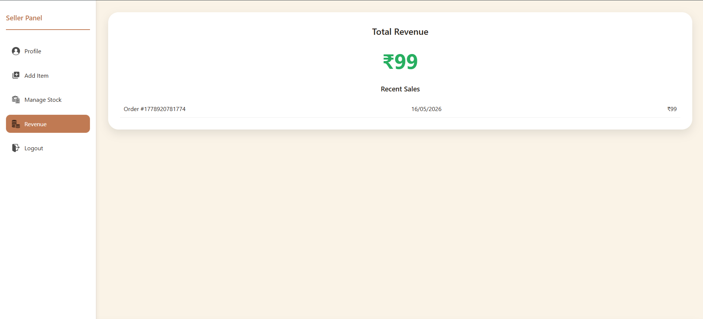
